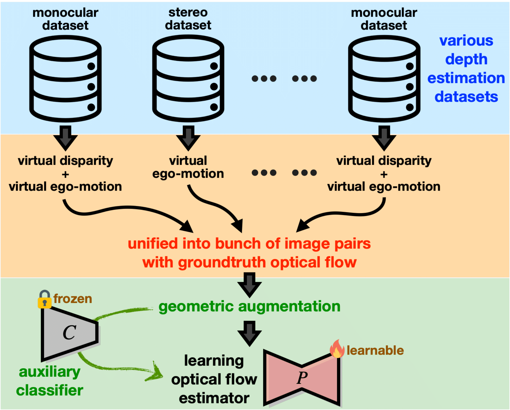

# OpticalFromDepth
This repository contains the source code for our paper:

Skin the sheep not only once:
Reusing Various Depth Datasets to Drive the Learning of Optical Flow</br>
Sheng-Chi Huang Wei-Chen Chiu<br/>



## Introduction

Optical flow estimation is crucial for various applications in vision and robotics. As the difficulty of collecting ground truth optical flow in real-world scenarios, most of the existing methods of learning optical flow still adopt synthetic dataset for supervised training or utilize photometric consistency across temporally adjacent video frames to drive the unsupervised learning, where the former typically has issues of generalizability while the latter usually performs worse than the supervised ones. To tackle such challenges, we propose to leverage the geometric connection between optical flow estimation and stereo matching (based on the similarity upon finding pixel correspondences across images) to unify various real-world depth estimation datasets for generating supervised training data upon optical flow. Specifically, we turn the monocular depth datasets into stereo ones via synthesizing virtual disparity, thus leading to the flows along the horizontal direction; moreover, we introduce virtual camera motion into stereo data to produce additional flows along the vertical direction. Furthermore, we propose applying geometric augmentations on one image of an optical flow pair, encouraging the optical flow estimator to learn from more challenging cases. Lastly, as the optical flow maps under different geometric augmentations actually exhibit distinct characteristics, an auxiliary classifier which trains to identify the type of augmentation from the appearance of the flow map is utilized to further enhance the learning of the optical flow estimator. Our proposed method is general and is not tied to any particular flow estimator, where extensive experiments based on various datasets and optical flow estimation models verify its efficacy and superiority.

## Installation

Create a virtual environment for this project.
```Shell
conda create --name OpticalFromDepth python=3.9
conda activate OpticalFromDepth
```

Clone this repo and install required packages, the code was developed with PyTorch 1.12.1 and Cuda 11.3.
```Shell
git clone https://github.com/AegeanKI/experiment
cd experiment
pip install torch==1.12.1+cu113 torchvision==0.13.1+cu113 torchaudio==0.12.1 --extra-index-url https://download.pytorch.org/whl/cu113
pip install -r requirement.txt
```

Compile `alt_cuda` module, which is written in C, to handle warping operation.
```Shell
cd alt_cuda
python setup.py install
```

## Preprocessing

We use `DIML` as sample, you can also use `filted_ReDWeb`.

```Shell
python preprocess.py --dataset DIML \
    --gpu 0 --split 1 --split_id 0
```

These parameters are:
* `dataset`: preprocess specific dataset
* `gpu`: preprocess dataset on specific gpu
* `split` and `split_id`: only preprocess part of dataset
* `subdir`: set the output subdirectory

## Datasets
To evaluate/train the RAFT/GMFlow models, you will need to download the required datasets.

* [FlyingChairs](https://lmb.informatik.uni-freiburg.de/resources/datasets/FlyingChairs.en.html#flyingchairs)
* [FlyingThings3D](https://lmb.informatik.uni-freiburg.de/resources/datasets/SceneFlowDatasets.en.html)
* [Sintel](http://sintel.is.tue.mpg.de/)
* [KITTI](http://www.cvlibs.net/datasets/kitti/eval_scene_flow.php?benchmark=flow)
* [DIML](https://dimlrgbd.github.io/#main)
* [ReDWeb](https://sites.google.com/site/redwebcvpr18/)

By default `dataset.py` in the RAFT model and the GMFlow model and `dataloader.py` will search for datasets in these locations. You can create symbolic links to whereever the datasets werer downloaded in the datasets folder. 

```Shell
├── datasets
    ├── Sintel
        ├── test
        ├── training
    ├── KITTI
        ├── testing
        ├── training
        ├── devkit
    ├── FlyingChairs_release
        ├── data
    ├── FlyingThings3D
        ├── frames_cleanpass
        ├── frames_finalpass
        ├── optical_flow
    ├── ReDWeb
        ├── Imgs
        ├── RDs
    ├── DIML
        ├── test
        ├── train
    ├── AugmentedDatasets
        ├── ReDWeb
        ├── DIML
```

You can use the following command to create a soft link dataset/datasetA folder connect to /real/path/to/datasetA.
```Shell
ln -s dataset/datasetA /real/path/to/datasetA
```

## Training
We use the mixed dataset (ReDWeb+DIML) as esample.

* Train on the RAFT model.
```Shell
cd adjusted_RAFT
python -u train.py --name adjusted_raft --stage mixed --validation kitti --gpus 0 \
   --num_steps 120000 --batch_size 8 --lr 0.0025 --val_freq 10000 \
   --mixed_precision --is_first_stage \
   --add_classifier \
   --classifier_checkpoint_timestamp 1677566045.275271 \
   --classifier_checkpoint_train_acc 0.805 \
   --classifier_checkpoint_test_acc 0.802 \
   --classify_loss_weight_init 1 \
   --classify_loss_weight_increase -0.00002 \
   --max_classify_loss_weight 1 \
   --min_classify_loss_weight 0
```

* Train on GMFlow model.
```Shell
name=gmflow-ad+s-c1-2e5-1

CHECKPOINT_DIR=checkpoints/adjusted_gmflow && \
mkdir -p ${CHECKPOINT_DIR} && \
CUDA_VISIBLE_DEVICES=2,3 \
python -m torch.distributed.launch --nproc_per_node=0 --master_port=9988 main.py \
    --launcher pytorch --checkpoint_dir ${CHECKPOINT_DIR} --stage mixed \
    --batch_size 16 --val_dataset sintel kitti --lr 4e-4 --image_size 368 560 \
    --padding_factor 16 --upsample_factor 8 --with_speed_metric --val_freq 1000 \
    --save_ckpt_freq 10000 --num_steps 100000 \
    --add_classifier \
    --classifier_checkpoint_timestamp 1677566045.275271 \
    --classifier_checkpoint_train_acc 0.805 \
    --classifier_checkpoint_test_acc 0.802 \
    --classify_loss_weight_init 1 \
    --classify_loss_weight_increase -0.00002 \
    --max_classify_loss_weight 1 \
    --min_classify_loss_weight 0 \
    2>&1 | tee -a ${checkpoint_dir}/train.log

```

These parameters are:
* `add_classifier`: enable classifier while training optical flow estimator
* `classifier_checkpoint_timestamp`: choose classifier directory (for classifier setting and checkpoints)
* `classifier_checkpoint_train_acc` and `classifier_checkpoint_test_acc`: choose classifier checkpoint
* `classify_loss_weight_init` and `classify_loss_weight_increase`: adjust the impact of classifier (linearly)
* `max_classify_loss_weight` and `min_classify_loss_weight`: set the upper and the lower bound of the impact of the classifier

## Testing
We use the validation set of KITTI-15 as esample. The ground truth of optical flow includes occluded area.
* You can download our pretrained models from [here](https://drive.google.com/drive/folders/1Iyx5YxuYjj1PSZxg70IintqCjGu9Y61l?usp=sharing)
* Test on the RAFT model.
    * TABLE I [R+D](https://drive.google.com/file/d/1vFfmqcX0cI6AvQo7MyyVSkr4Cp1KxE_A/view?usp=drive_link), [C->T->R+D](https://drive.google.com/file/d/1B-zu57m4x4YsgWbqQz3eJeHsTPuVvSgU/view?usp=drive_link)
    * TABLE III [full](https://drive.google.com/file/d/1cGBm-8qxfNBX5Tq6ClVFIKolk9juewJN/view?usp=drive_link), [-classifier](https://drive.google.com/file/d/1vq3CqNJBHzmjhiRu0KePT2T2TQwnBzrB/view?usp=drive_link), [+virtual disparity](https://drive.google.com/file/d/1_nGbV2bW8jv5Q6CdZJigmVFsWQCReJ1F/view?usp=drive_link), [none](https://drive.google.com/file/d/1Ec9_oFHi2aq8x5KSXry2Jk9Lj3kD8TFe/view?usp=drive_link)
```Shell
python evaluate.py --model=models/raft-mixed-c.pth \
                   --dataset=kitti \
                   --mixed_precision
```

* Test on the GMFlow model.
    * [R+D]()
```Shell
CUDA_VISIBLE_DEVICES=0 python main.py --eval --val_dataset things sintel \
                                      --resume pretrained/gmflow_things-e9887eda.pth
```

## Acknowledgement

* The preprocessing code of the virtual ego-motion is borrowed from [depthstillation](https://github.com/mattpoggi/depthstillation)
* The training code and the testing code of the RAFT model is borrowed from [RAFT](https://github.com/princeton-vl/RAFT)
* The training code and the testing code of the GMFlow model is borrowed from [GMFlow](https://github.com/haofeixu/gmflow)


